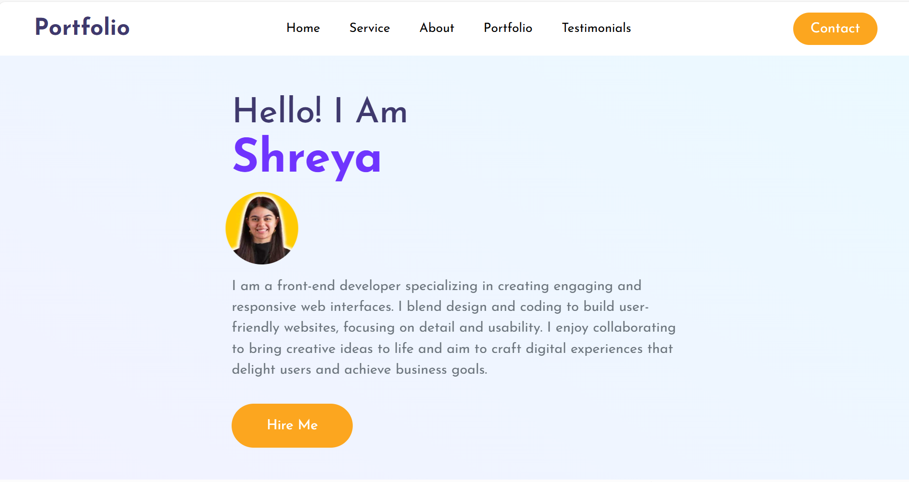
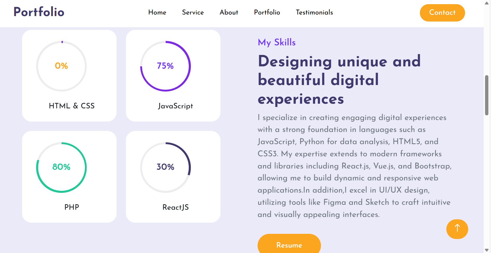
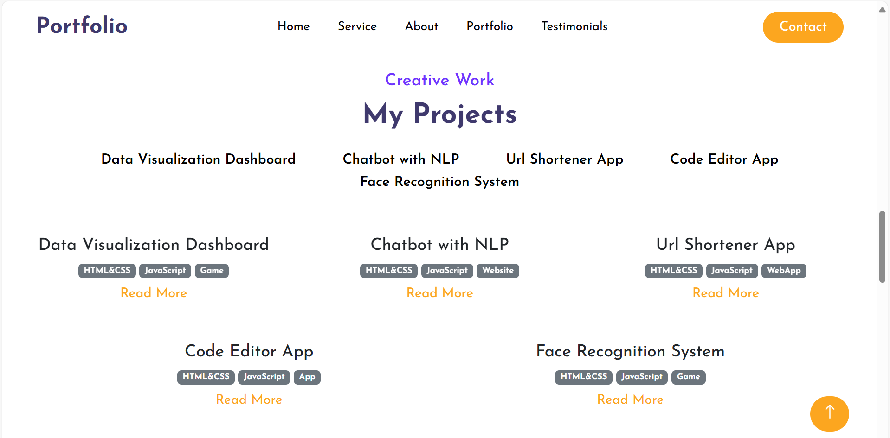
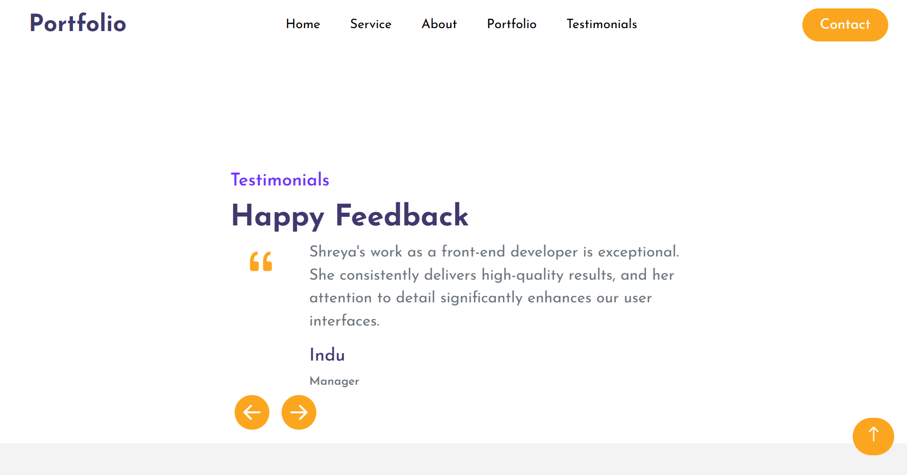
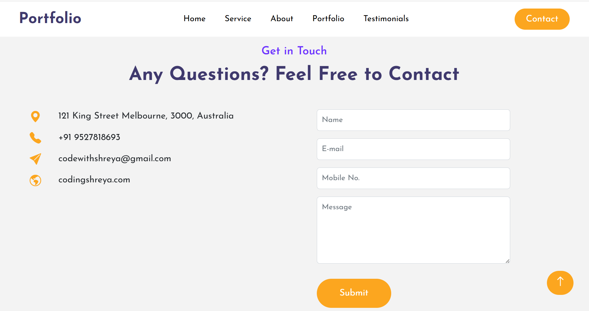
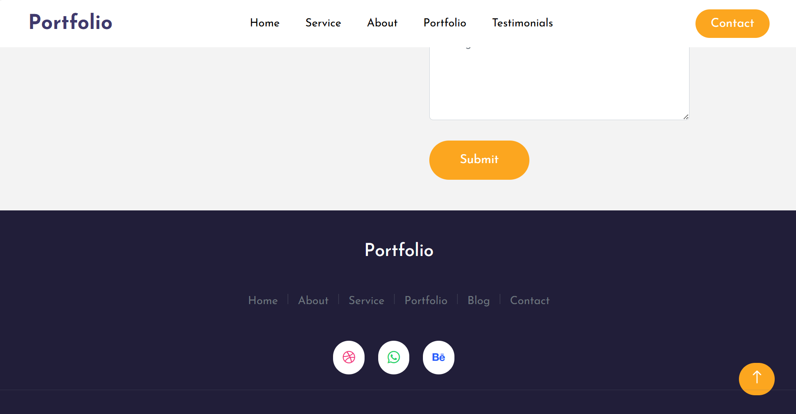

# Fake-Profolio-Making
Created with CodeSandbox
I participated in the Profolio event, where I created a portfolio using fake data. The goal was to design and showcase a professional portfolio, demonstrating skills in web development and design.
### Screenshots

Here are some screenshots of the project:

#### Hello Page

#### Experience Page

#### Skills Page

#### Projects Page

#### Feedback Page

#### Contact Page

#### Footer Section

